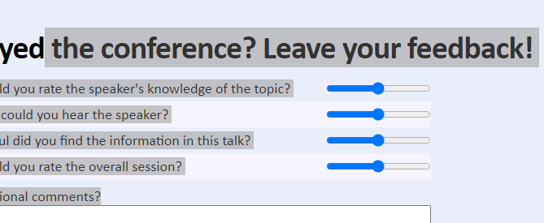
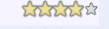

## Laboratorio

### Exercise 1: Applying CSS Transitions

1.- revisamos los tag y los links de feedback.htm
```html
<script src="/scripts/pages/feedback.js" type="text/javascript"></script>
<link href="/styles/pages/feedback.css" rel="stylesheet" type="text/css" />

       <section class="page-section feedback">
            <div class="container">
                <section id="feedback">
                    <h1>Enjoyed t   he conference? Leave your feedback!</h1>
                    <form method="post" action="/send-feedback">
                        <div class="field feedback-question">
                            <label>How would you rate the speaker's knowledge of the topic?</label>
                            <input name="question" type="range" min="1" max="5"/>
                        </div>
```

2.- animar las estrellas en el formulario de comentarios

```html
  <link href="/styles/pages/feedback.css" rel="stylesheet" type="text/css" />
```


para crear las estrellas de forma programatica
ya que es un range
````html
  <input name="question" type="range" min="1" max="5"/>
````
 


lo que pasa es que ejecuta lo siguiente
````javascriptyccss
const questions = form.querySelectorAll(".feedback-question");
for (let i = 0; i < questions.length; i++) {
    new StarRatingView(questions[i]);
}

 StarRatingView.js

    constructor(element) {
        this.element = element;
        this.inputElement = element.querySelector("input");

        this.createUI();
        this.listenForStarMouseEvents();
    }

    createUI() {
        const min = parseInt(this.inputElement.min, 10);
        const max = parseInt(this.inputElement.max, 10);
        this.starElements = [];
        for (let rating = min; rating <= max; rating++) {
            const starElement = this.createStarElement(rating);
            this.element.appendChild(starElement);
            this.starElements.push(starElement);
        }

        this.inputElement.style.display = "none";
    }

    createStarElement(rating) {
        const starElement = document.createElement("div");
        starElement.setAttribute("class", "star");
        starElement.ratingValue = rating;
        return starElement;
    }

.star {
    background-image: url(../images/stars.png);
    width: 15px;
    height: 15px;
    cursor: pointer;
    margin: .1rem;
    -ms-flex: 0 0 15px;
    flex: 0 0 15px;
    
    /* TODO: Transition the transform property over 0.5 seconds */
}

````


la animacion consiste en  modificarel css .star:hover,  .star.hove
 escala transform: scale(1.3, 1.3);  y tiempo   transition: transform .5s; 


````css
.star:hover,
  .star.hover {
      background-position: 0 -15px;

      /* TODO: Scale transform by 1.3 */
       transform: scale(1.3, 1.3); 

      /* TODO: Transition the transform property over 0.5 seconds */
       transition: transform .5s; 
  }
```` 


con eso se consigue el efecto 

 


````
  listenForStarMouseEvents() {
        // Add event listener to the container element.
        // The events of child star elements will bubble up.
        this.element.addEventListener("click", this.starClicked.bind(this), false);
        this.element.addEventListener("mouseover", this.starMousedOver.bind(this), false);
        this.element.addEventListener("mouseout", this.starMousedOut.bind(this), false);
    }

    starClicked(e) {
        const element = e.srcElement || e.target;
        if (!element.classList.contains("star")) return;

        this.setRating(element.ratingValue);
    }

    starMousedOver(e) {
        // Mousing over a star will toggle the "hover" state for it and all preceeding stars.

        const element = e.srcElement || e.target;
        if (!element.classList.contains("star")) return;

        this.setHoverState(element.ratingValue);
    }

    starMousedOut(e) {
        const element = e.srcElement || e.target;
        if (!element.classList.contains("star")) return;
        this.removeHoverStates();
    }

    setHoverState(rating) {
        for (let i = 0; i < rating; i++) {
            this.starElements[i].classList.add("hover");
        }
    }

    removeHoverStates() {
        for (let i = 0, length = this.starElements.length; i < length; i++) {
            this.starElements[i].classList.remove("hover");
        }
    }

    setRating(rating) {
        this.inputElement.value = rating;

        let index;
        const max = this.starElements.length;
        for (index = 0; index < rating; index++) {
            this.starElements[index].classList.add("selected");
        }
        for (index = rating; index < max; index++) {
            this.starElements[index].classList.remove("selected");
        }
    }
````


3.  animar el enlace Registrarse en la página de inicio

vamos a animar el enlace register del index 
```html
<a class="register" href="/register.htm">
    Register<br />
    <span class="free">&#183; Free &#183;</span>                
</a>


header.page-header .register {
    display: block;
    position: absolute;
    top: 20px;
    right: 35px;
    width: 160px;
    height: 100px;
    padding-top: 60px;
    opacity: 0.8;
    font-size: 2.7rem;
    color: #fff;
    text-align: center;
    text-decoration: none;
    text-transform: uppercase;
    -ms-border-radius: 100%;
    border-radius: 100%;
    text-shadow: 0 1px 0 #000;
    -ms-transform: rotate(6deg);
    transform: rotate(6deg);
    background: -ms-linear-gradient(#a80000, #740404);
    background: linear-gradient(#a80000, #740404);

    /* TODO: Transition the transform property over 1 second */
}

header.page-header .register:hover {
    color: #fff;
    background: -ms-linear-gradient(#bc0101, #8c0909);
    background: linear-gradient(#bc0101, #8c0909);

    /* TODO: rotate to 16 degrees and scale by 1.1 */
    
    /* TODO: Transition the transform property over 1 second */
}

header.page-header .register:before /* Creates dotted border */ {
    display: block;
    position: absolute;
    top: -7px;
    right: -7px;
    height: 168px;
    width: 168px;
    content: "";
    border: 3px dotted #740404;
    -ms-border-radius: 100%;
    border-radius: 100%;
}

header.page-header .register .free {
    font-size: 80%;
}
```` 


ahora lo que hacemos es modificar 

```csss
header.page-header .register {
.....
/* TODO: Transition the transform property over 1 second */
       transition: transform 1s; 
}
header.page-header .register:hover {
      color: #fff;
      background: -ms-linear-gradient(#bc0101, #8c0909);
      background: linear-gradient(#bc0101, #8c0909);

      /* TODO: rotate to 16 degrees and scale by 1.1 */
       transform: rotate(16deg) scale(1.1, 1.1);

      /* TODO: Transition the transform property over 1 second */
     transition: transform 1s; 
  }
````

este es el efecto

 
 