### Laboratorio 13 WEBSOCKETS


1.  Exercise 1: Receiving Messages from a Web Socket
Revisión de la aplicacion
live.htm
````htm
<section class="page-section live">
    <div class="container">
        <h1>Attending the conference right now? Get involved!</h1>
        <form action="#"> 
         <!--  action="#" el formulario permanece en la misma página -->
            <label for="ask-question-text">Ask a question</label>
            <input id="ask-question-text" type="text" />
            <button type="submit">Ask</button>
        </form>
        <ul>
            <!-- Questions will be displayed here when received by the web socket. -->
        </ul>
    </div>
</section>


<script src="/scripts/pages/live.js" type="module"></script>
````
/scripts/pages/live.js
```javascript

import {LivePage} from "../LivePage.js";
// TODO: Create a web socket connection to ws://localhost:55981/live/socket.ashx
const socket = new WebSocket("ws://localhost:55981/live/socket.ashx");
new LivePage(
    socket,
    document.querySelector("section.live")
);

```` 

../LivePage.js
```javascript
export class LivePage {

    constructor(socket, sectionElement) {this.initializeSocket(socket); this.initializeUI(sectionElement);}

    initializeSocket(socket) {
        this.socket = socket;
        // TODO: Assign a callback to handle messages from the socket.
        this.socket.onmessage = this.handleSocketMessage.bind(this); ////// <<<<<<<<<<<<<<<<<<<<<<<<<<<<<
    }

    initializeUI(sectionElement) {  ///// section.live
        this.questionListElement = sectionElement.querySelector("ul");
        this.questionInput = sectionElement.querySelector("input");
        const form = sectionElement.querySelector("form");
        form.addEventListener("click", this.handleFormSubmit.bind(this), false);
        this.questionListElement.addEventListener("click", this.handleQuestionsClick.bind(this), false);
    }


    handleFormSubmit(event) {
        // Prevent the form actually submitting.
        event.preventDefault();
        const text = this.questionInput.value;
        if (text) {
            this.askQuestion(text);
        }
    }

    askQuestion(text) {
        // TODO: Create a message object with the format { ask: text }

        // TODO: Convert the message object into a JSON string

        // TODO: Send the message to the socket

        // Clear the input ready for another question.
        this.questionInput.value = "";
    }

    handleSocketMessage(event) {
        // TODO: Parse the event data into message object.
        const message = JSON.parse(event.data);

        // TODO: Check if message has a `questions` property, before calling handleQuestionsMessage
        if (message.questions) {
            this.handleQuestionsMessage(message);
        }
    }

    handleQuestionsMessage(message) {
        // message has the form:
        //   { questions: [
        //         { text: "...", id: 1 },
        //         { text: "...", id: 2 }
        //   ] }

        // TODO: Display each question in the page, using the displayQuestion function.
        message.questions.forEach(this.displayQuestion, this);
    }

    handleRemoveMessage(message) {
        const listItems = this.questionListElement.querySelectorAll("li");
        for (let i = 0; i < listItems.length; i++) {
            if (listItems[i].questionId === message.remove) {
                this.questionListElement.removeChild(listItems[i]);
                break;
            }
        }
    }

    displayQuestion(question) {
        const item = this.createQuestionItem(question);
        //item.appendChild(this.createReportLink());
        this.questionListElement.appendChild(item);
    }

    createQuestionItem(question) {
        const item = document.createElement("li");
        item.textContent = question.text + " ";
        item.questionId = question.id;
        return item;
    }

    createReportLink() {
        const report = document.createElement("a");
        report.textContent = "Report";
        report.setAttribute("href", "#");
        report.setAttribute("class", "report");
        return report;
    }

    handleQuestionsClick(event) {
        event.preventDefault();

        const clickedElement = event.srcElement || event.target;
        if (this.isReportLink(clickedElement)) {
            const questionId = clickedElement.parentNode.questionId;
            this.reportQuestion(questionId);
            clickedElement.textContent = "Reported";
        }
    }

    isReportLink(element) {
        return element.classList && element.classList.contains("report");
    }

    reportQuestion(questionId) {
        // TODO: Send socket message { report: questionId }
    }
}
*/*
````


Recibiendo mensajes


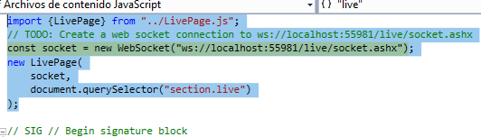

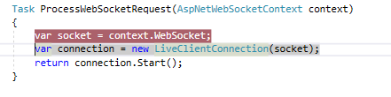
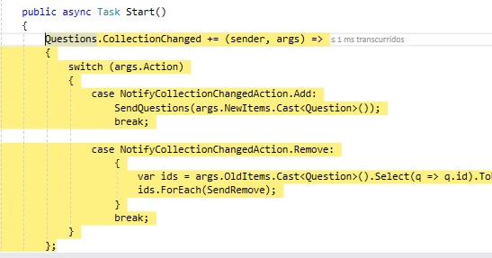

simula que hay preguntas sino manda questions
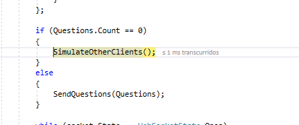
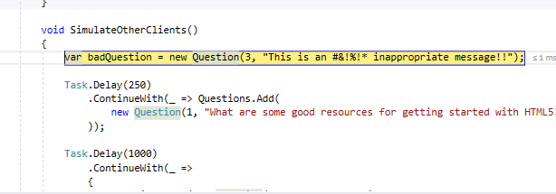


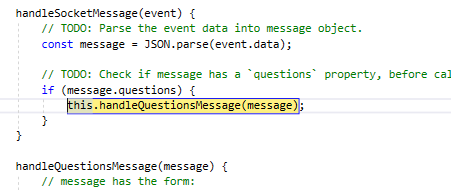
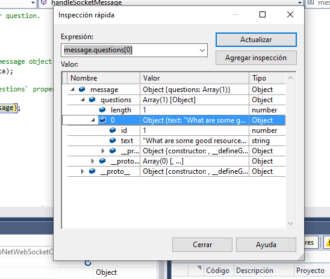
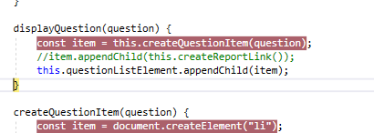
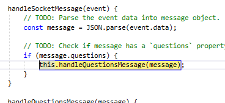


Cada vez que entramos en una instancia de la página se comunica con el ws
y si el numero de question es 0 rellena 
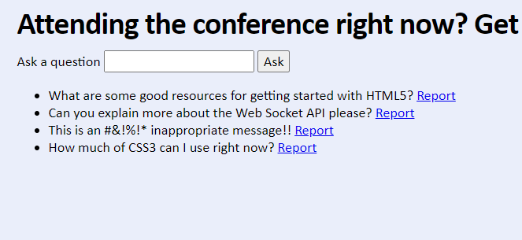


2. Exercise 2: Sending Messages to a Web Socket

modificamos la funcion askQuestion

```javascript

 askQuestion(text) {
        // TODO: Create a message object with the format { ask: text }
        const message = { "ask" : text};
        // TODO: Convert the message object into a JSON string
        const json = JSON.stringify(message);
        // TODO: Send the message to the socket
        this.socket.send(json);
        // Clear the input ready for another question.
        this.questionInput.value = "";
    }
````
esta función esta asociada al evento de submit
```javascript
 handleFormSubmit(event) {
        // Prevent the form actually submitting.
        event.preventDefault();

        const text = this.questionInput.value;
        if (text) {
            this.askQuestion(text);
        }
    }


    initializeUI(sectionElement) {
        this.questionListElement = sectionElement.querySelector("ul");
        this.questionInput = sectionElement.querySelector("input");

        const form = sectionElement.querySelector("form");
        form.addEventListener("click", this.handleFormSubmit.bind(this), false);

        this.questionListElement.addEventListener("click", this.handleQuestionsClick.bind(this), false);
    }
````

probamos a enviar una pregunta
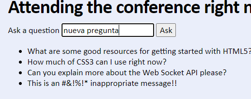
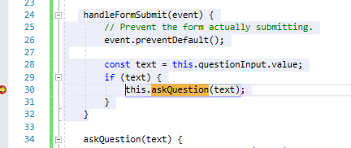
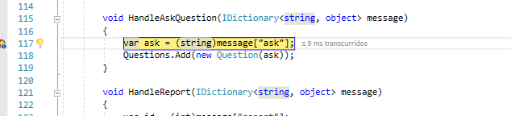

al enviar el mensaje el server actualiza

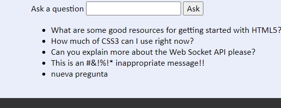

si ejecutamos una nueva instancia de live en otro navegador  presenta esta nueva pregunta
ya que la nueva pregunta esta en la lista de quuestions en el servidor

3. Ejercicio 3: Manejo de diferentes tipos de mensajes de Web Socket
 
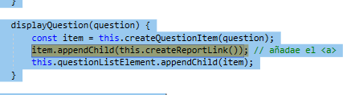
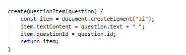

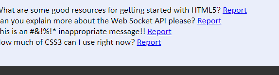
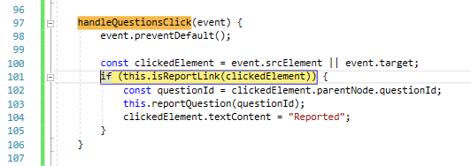
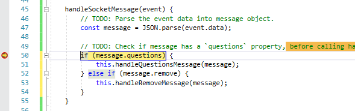

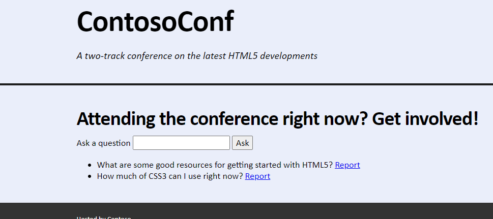