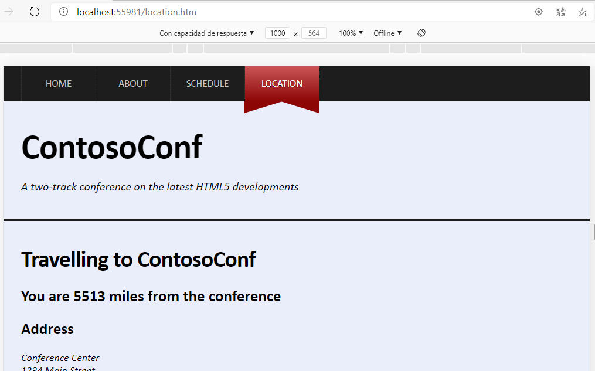
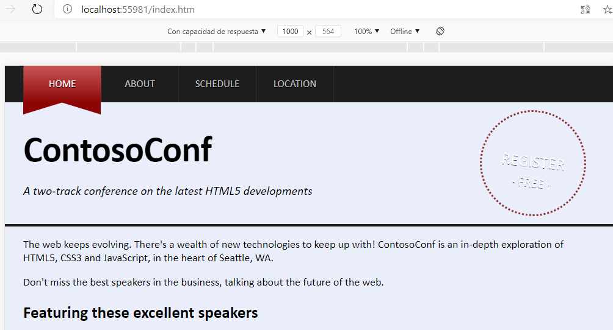
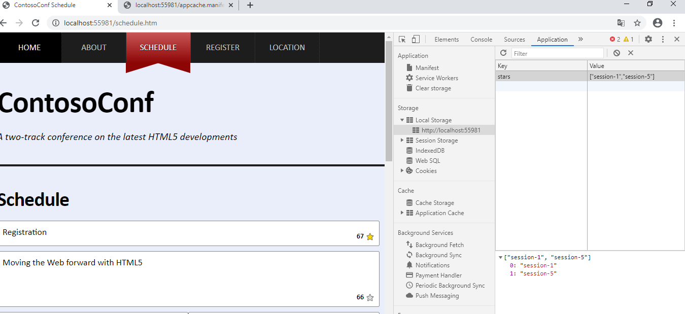

### Caching Offline Data by Using the Application Cache API

configurar el manifiesto


 

 

lo añadimos a las páginas que queremos que se cacheeen

````javascript
<html lang="en" manifest="/appcache.manifest">
````


detectar el modo offline mediante javascript
_offline.js_

```javascript
const offlinePages = /^\/(index|about|schedule|location).htm$/;

function hideLinksThatRequireOnline() {
    const allNavLinks = document.querySelectorAll("nav.page-nav a");
    for (let i = 0; i < allNavLinks.length; i++) {
        const href = allNavLinks[i].getAttribute("href");
        if (!offlinePages.test(href)) {
            allNavLinks[i].style.display = "none";
        }
    }
};

function showLinks() {
    const allNavLinks = document.querySelectorAll("nav.page-nav a");
    for (let i = 0; i < allNavLinks.length; i++) {
        allNavLinks[i].style.display = "";
    }
};


    // TODO: if currently offline, hide navigation links that require online
if (!navigator.onLine) {
    hideLinksThatRequireOnline();
}

    // TODO: add onoffline and ononline events to document.body,
    //       which either hide or show navigation links.
document.body.onoffline = hideLinksThatRequireOnline;
document.body.ononline = showLinks;

    // TODO: also handle the applicationCache error event to hide links

applicationCache.addEventListener("error", hideLinksThatRequireOnline, false);
````


### Persisting User Data by Using the Local Storage API

queremos persisiir informacion de las estrellas en Schedule page

para ello modificamos el archivo LocalStarStorage.js.

 